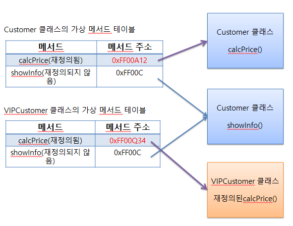

# 가상 메서드
### 변수가 사용하는 메모리 != 메서드가 사용하는 메모리
- 메서드는 실행해야 할 명령 집합이므로, 같은 객체를 여러 개 생성한다고 해서 메서드도 여러 개 생성되지 않음
- 지역 변수 → Stack 메모리
- 인스턴스  → Heap 메모리
<br><br>
## 가상 메서드의 원리
- 일반적인 메서드 호출 → 해당 메서드의 메모리 위치 참조
- 가상 메서드 → <strong>'가상 메서드 테이블'</strong>이 만들어짐
- 가상 메서드 테이블은 메서드 이름과 실제 메모리 주소가 짝을 이루고 있어, 특정 메서드가 호출되면 테이블에서 주소 값을 찾아 명령을 수행
- 재정의된 메서드는 실제 인스턴스에 해당하는 메서드가 호출됨
<br><br>

### <해당 클래스의 가상 메서드 테이블 구조>
 
<br><br>

``` java
public class CustomerTest1 {
	public static void main(String[] args) {
		
		Customer cus1 = new Customer();
		cus1.setCusID(10010);
		cus1.setCusName("이순신");
		cus1.bonusPoint = 1000;
		
		Customer Vcus1 = new VIPCustomer(10020, "김유신");
		Vcus1.bonusPoint = 10000;
		
		System.out.println(cus1.showInfo());
		System.out.println(Vcus1.showInfo());
		
		System.out.println("=================");
		int bag = 100000;
		System.out.println(cus1.getCusName() + "이 지불해야하는 값: " + cus1.calcPrice(bag));
		System.out.println(Vcus1.getCusName() + "이 지불해야하는 값: " + Vcus1.calcPrice(bag));
	}
}

 ```
 
<br><br><br><br>

### Vcus1.calcPrice() 호출
- 해당 객체를 선언할 때 사용한 자료형(Customer) 이 호출되는 것이 아니라, 생성된 인스턴스의 메서드가 호출(VIPCustomer) 된다.  →  가상 메서드
- Java의 모든 메서드는 가상 메서드이다
<br><br><br><br><br><br><br><br>


# 다형성
- 하나의 코드가 여러 자료형으로 구현되는 것

## 다형성의 장점
1. 코드 양이 줄어든다
2. 유지보수가 편리함
3. 프로그램을 쉽게 확장할 수 있다
<br><br><br><br>

# 다형성 활용
### [+ 시나리오 : GOLD 고객 등급 추가]
#### 제품 구매시 항상 10% 할인, 포인트 2% 적립, 담당 상담원 X

``` java
public class GOLDCustomer extends Customer {
	double SaleRatio;		// 할인율
	
	public GOLDCustomer(int cusID, String cusName) { 
		super(cusID, cusName);
		cusGrade = "GOLD";
		bonusRatio = 0.02;
		SaleRatio = 0.1;
	}
	
	public int calcPrice(int price) {
		bonusPoint += price * bonusRatio;
		return price - (int)(price*SaleRatio);
	}
}
 ```
<br>

### [+ 시나리오 : 배열로 고객 5명 구현]
#### VIP: 1 COLD: 2 SILVER: 2 총 5명을 관리
#### 5명의 고객이 10,000원짜리 상품을 구매했을 때 결과 출력

